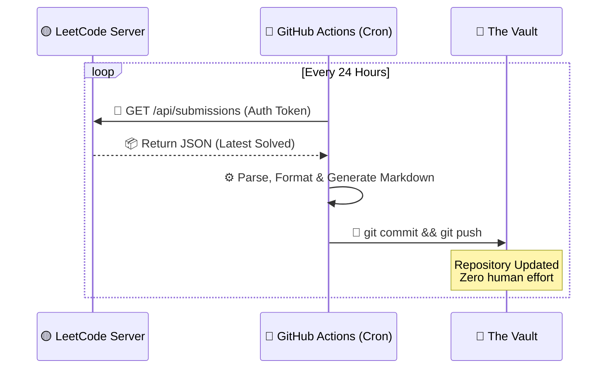
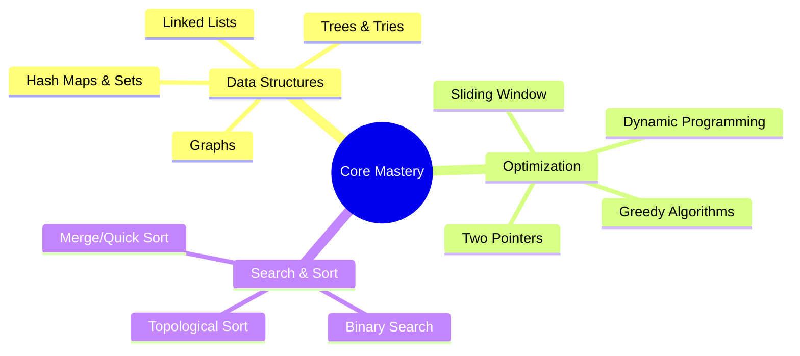
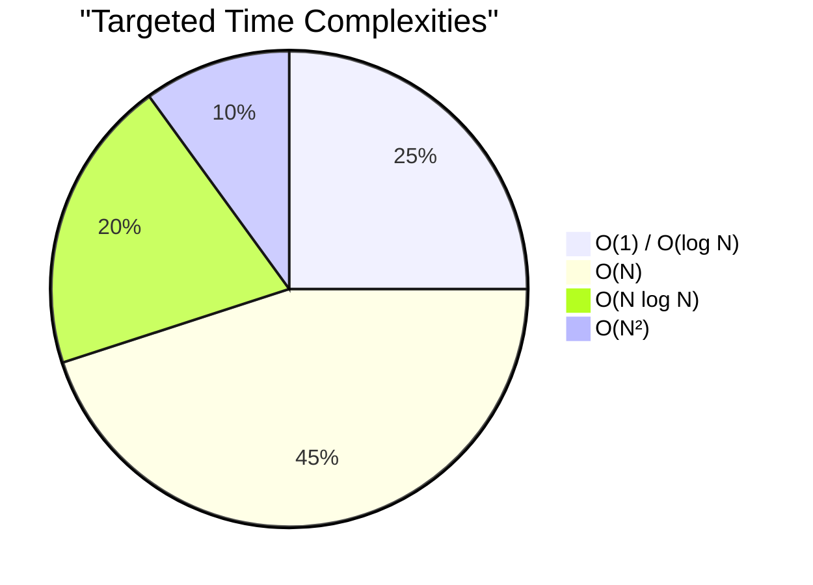
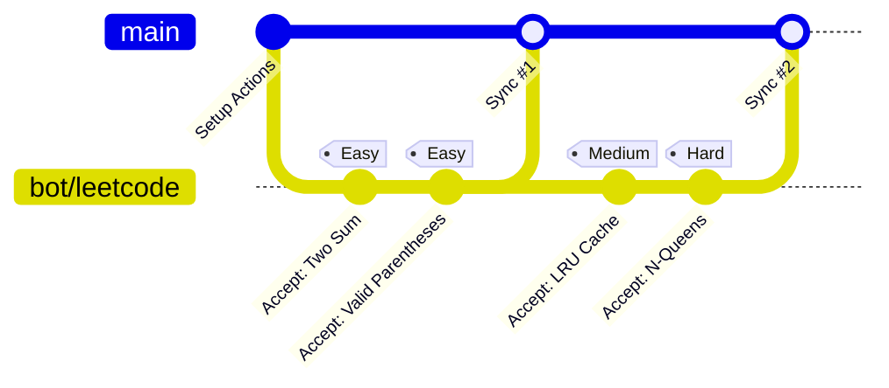

<div align="center">


<a href="https://leetcode.com/u/5VPjMsfuqV/">
  
</a>

<br/>

[](https://leetcode.com/u/5VPjMsfuqV/)
[](https://github.com/AyushSingh360/algorithm-arsenal/actions)
[](#-tech-stack)

<br/>

<a href="https://leetcode.com/u/5VPjMsfuqV/">
  
</a>

</div>

---

### 🚀 ` System.Overview `

Welcome to the **Vault**. This isn't just a repository; it's an automated, self-updating timeline of my algorithmic journey. Every time a problem is conquered on LeetCode, a serverless pipeline instantly pulls the optimal solution, formats it, and injects it directly into this codebase. Zero manual intervention. Maximum efficiency.

<br>

<div align="center">
  
| ⚡ **Speed** | 🧠 **Complexity** | 🏗️ **Architecture** |
| :---: | :---: | :---: |
| Sub-millisecond Execution | O(1) State of Mind | Fully CI/CD Automated |

</div>

<br>

### 🧬 ` Automation.Matrix `



<br>

### 🕸️ ` Algorithmic.Skill_Tree `

A dynamic mapping of the core competencies being trained and cataloged within this repository.



<br>

### 📊 ` Complexity.Distribution `

Conceptual breakdown of optimal solution approaches targeted in this archive.



<br>

### 🌿 ` Version_Control.Topology `

How the automated bot interacts with the Git history upon solving challenges.



<br>

### 🗄️ ` Data.Structures `

The archive is meticulously sorted for rapid O(1) retrieval.

<details open>
<summary><b>📂 Click to Expand Directory Tree</b></summary>
<br>

```bash
root@leetcode-vault:~# tree -L 2
.
├── ⚙️ .github/
│   └── 🤖 workflows/           # CI/CD Sync Engine
├── 🧠 leetcode/                # The Algorithm Core
│   ├── 🟢 Easy/                # Warm-ups & Fundamentals
│   ├── 🟡 Medium/              # Logic & Data Structures
│   └── 🔴 Hard/                # Advanced Optimization
└── 📜 README.md                # System Documentation
```

</details>

<br>

### 💻 ` Tech.Stack `

<table align="center">
  <tr>
    <td align="center" width="96">
      
      <br>C++
    </td>
    <td align="center" width="96">
      
      <br>Python
    </td>
    <td align="center" width="96">
      
      <br>Java
    </td>
    <td align="center" width="96">
      
      <br>JavaScript
    </td>
    <td align="center" width="96">
      
      <br>Actions
    </td>
  </tr>
</table>

<br>

### 📡 `Establish.Connection`

Let's collaborate on system design, competitive programming, or next-gen tech.

<p align="center">
  <a href="https://leetcode.com/u/5VPjMsfuqV/">
    
  </a>
  <a href="https://github.com/AyushSingh360">
    
  </a>
  <a href="https://www.linkedin.com/in/ayushsingh360/">
    
  </a>
</p>

<br>

### 🗂️ ` Solution.Index `

> [!TIP]
> 🔍 **Search by Number:** Press <kbd>Ctrl</kbd> / <kbd>Cmd</kbd> + <kbd>F</kbd> and type the problem number (e.g., `| 1 |` or just `1`) to jump directly to it!

<!-- INDEX_START -->
| # | Problem | Language | Code |
| :--- | :--- | :---: | :---: |
| 115 | Distinct Subsequences | `Python` | [View](./leetcode/0115-distinct-subsequences) |
| 409 | Longest Palindrome | `Python` | [View](./leetcode/0409-longest-palindrome) |
| 412 | Fizz Buzz | `Python` | [View](./leetcode/0412-fizz-buzz) |
| 413 | Arithmetic Slices | `Python` | [View](./leetcode/0413-arithmetic-slices) |
| 414 | Third Maximum Number | `Python` | [View](./leetcode/0414-third-maximum-number) |
| 415 | Add Strings | `Python` | [View](./leetcode/0415-add-strings) |
| 416 | Partition Equal Subset Sum | `Python` | [View](./leetcode/0416-partition-equal-subset-sum) |
| 419 | Battleships In A Board | `Python` | [View](./leetcode/0419-battleships-in-a-board) |
| 421 | Maximum Xor Of Two Numbers In An Array | `Python` | [View](./leetcode/0421-maximum-xor-of-two-numbers-in-an-array) |
| 423 | Reconstruct Original Digits From English | `Python` | [View](./leetcode/0423-reconstruct-original-digits-from-english) |
| 424 | Longest Repeating Character Replacement | `Python` | [View](./leetcode/0424-longest-repeating-character-replacement) |
| 433 | Minimum Genetic Mutation | `Python` | [View](./leetcode/0433-minimum-genetic-mutation) |
| 434 | Number Of Segments In A String | `Python` | [View](./leetcode/0434-number-of-segments-in-a-string) |
| 435 | Non Overlapping Intervals | `Python` | [View](./leetcode/0435-non-overlapping-intervals) |
| 436 | Find Right Interval | `Python` | [View](./leetcode/0436-find-right-interval) |
| 437 | Path Sum Iii | `Python` | [View](./leetcode/0437-path-sum-iii) |
| 438 | Find All Anagrams In A String | `Python` | [View](./leetcode/0438-find-all-anagrams-in-a-string) |
| 441 | Arranging Coins | `Python` | [View](./leetcode/0441-arranging-coins) |
| 442 | Find All Duplicates In An Array | `Python` | [View](./leetcode/0442-find-all-duplicates-in-an-array) |
| 443 | String Compression | `Python` | [View](./leetcode/0443-string-compression) |
| 445 | Add Two Numbers Ii | `Python` | [View](./leetcode/0445-add-two-numbers-ii) |
| 447 | Number Of Boomerangs | `Python` | [View](./leetcode/0447-number-of-boomerangs) |
| 449 | Serialize And Deserialize Bst | `Python` | [View](./leetcode/0449-serialize-and-deserialize-bst) |
| 450 | Delete Node In A Bst | `Python` | [View](./leetcode/0450-delete-node-in-a-bst) |
| 451 | Sort Characters By Frequency | `Python` | [View](./leetcode/0451-sort-characters-by-frequency) |
| 452 | Minimum Number Of Arrows To Burst Balloons | `Python` | [View](./leetcode/0452-minimum-number-of-arrows-to-burst-balloons) |
| 453 | Minimum Moves To Equal Array Elements | `Python` | [View](./leetcode/0453-minimum-moves-to-equal-array-elements) |
| 454 | 4Sum Ii | `Python` | [View](./leetcode/0454-4sum-ii) |
| 455 | Assign Cookies | `Python` | [View](./leetcode/0455-assign-cookies) |
| 456 | 132 Pattern | `Python` | [View](./leetcode/0456-132-pattern) |
| 457 | Circular Array Loop | `Python` | [View](./leetcode/0457-circular-array-loop) |
| 459 | Repeated Substring Pattern | `Python` | [View](./leetcode/0459-repeated-substring-pattern) |
| 461 | Hamming Distance | `Python` | [View](./leetcode/0461-hamming-distance) |
| 462 | Minimum Moves To Equal Array Elements Ii | `Python` | [View](./leetcode/0462-minimum-moves-to-equal-array-elements-ii) |
| 463 | Island Perimeter | `Python` | [View](./leetcode/0463-island-perimeter) |
| 464 | Can I Win | `Python` | [View](./leetcode/0464-can-i-win) |
| 467 | Unique Substrings In Wraparound String | `Python` | [View](./leetcode/0467-unique-substrings-in-wraparound-string) |
| 468 | Validate Ip Address | `Python` | [View](./leetcode/0468-validate-ip-address) |
| 473 | Matchsticks To Square | `Python` | [View](./leetcode/0473-matchsticks-to-square) |
| 475 | Heaters | `Python` | [View](./leetcode/0475-heaters) |
| 476 | Number Complement | `Python` | [View](./leetcode/0476-number-complement) |
| 477 | Total Hamming Distance | `Python` | [View](./leetcode/0477-total-hamming-distance) |
| 481 | Magical String | `Python` | [View](./leetcode/0481-magical-string) |
| 482 | License Key Formatting | `Python` | [View](./leetcode/0482-license-key-formatting) |
| 486 | Predict The Winner | `Python` | [View](./leetcode/0486-predict-the-winner) |
| 491 | Non Decreasing Subsequences | `Python` | [View](./leetcode/0491-non-decreasing-subsequences) |
| 492 | Construct The Rectangle | `Python` | [View](./leetcode/0492-construct-the-rectangle) |
| 494 | Target Sum | `Python` | [View](./leetcode/0494-target-sum) |
| 495 | Teemo Attacking | `Python` | [View](./leetcode/0495-teemo-attacking) |
| 496 | Next Greater Element I | `Python` | [View](./leetcode/0496-next-greater-element-i) |
| 498 | Diagonal Traverse | `Python` | [View](./leetcode/0498-diagonal-traverse) |
| 500 | Keyboard Row | `Python` | [View](./leetcode/0500-keyboard-row) |
| 501 | Find Mode In Binary Search Tree | `Python` | [View](./leetcode/0501-find-mode-in-binary-search-tree) |
| 503 | Next Greater Element Ii | `Python` | [View](./leetcode/0503-next-greater-element-ii) |
| 504 | Base 7 | `Python` | [View](./leetcode/0504-base-7) |
| 506 | Relative Ranks | `Python` | [View](./leetcode/0506-relative-ranks) |
| 507 | Perfect Number | `Python` | [View](./leetcode/0507-perfect-number) |
| 508 | Most Frequent Subtree Sum | `Python` | [View](./leetcode/0508-most-frequent-subtree-sum) |
| 513 | Find Bottom Left Tree Value | `Python` | [View](./leetcode/0513-find-bottom-left-tree-value) |
| 515 | Find Largest Value In Each Tree Row | `Python` | [View](./leetcode/0515-find-largest-value-in-each-tree-row) |
| 516 | Longest Palindromic Subsequence | `Python` | [View](./leetcode/0516-longest-palindromic-subsequence) |
| 518 | Coin Change Ii | `Python` | [View](./leetcode/0518-coin-change-ii) |
| 520 | Detect Capital | `Python` | [View](./leetcode/0520-detect-capital) |
| 521 | Longest Uncommon Subsequence I | `Python` | [View](./leetcode/0521-longest-uncommon-subsequence-i) |
| 522 | Longest Uncommon Subsequence Ii | `Python` | [View](./leetcode/0522-longest-uncommon-subsequence-ii) |
| 523 | Continuous Subarray Sum | `Python` | [View](./leetcode/0523-continuous-subarray-sum) |
| 524 | Longest Word In Dictionary Through Deleting | `Python` | [View](./leetcode/0524-longest-word-in-dictionary-through-deleting) |
| 525 | Contiguous Array | `Python` | [View](./leetcode/0525-contiguous-array) |
| 526 | Beautiful Arrangement | `Python` | [View](./leetcode/0526-beautiful-arrangement) |
| 529 | Minesweeper | `Python` | [View](./leetcode/0529-minesweeper) |
| 530 | Minimum Absolute Difference In Bst | `Python` | [View](./leetcode/0530-minimum-absolute-difference-in-bst) |
| 539 | Minimum Time Difference | `Python` | [View](./leetcode/0539-minimum-time-difference) |
| 628 | Maximum Product Of Three Numbers | `Python` | [View](./leetcode/0628-maximum-product-of-three-numbers) |
| 764 | N Ary Tree Level Order Traversal | `Python` | [View](./leetcode/0764-n-ary-tree-level-order-traversal) |
| 766 | Flatten A Multilevel Doubly Linked List | `Python` | [View](./leetcode/0766-flatten-a-multilevel-doubly-linked-list) |
| 772 | Construct Quad Tree | `Python` | [View](./leetcode/0772-construct-quad-tree) |
| 903 | Implement Rand10 Using Rand7 | `Python` | [View](./leetcode/0903-implement-rand10-using-rand7) |
| 909 | Stone Game | `Python` | [View](./leetcode/0909-stone-game) |
| 912 | Random Pick With Weight | `Python` | [View](./leetcode/0912-random-pick-with-weight) |
| 913 | Random Flip Matrix | `Python` | [View](./leetcode/0913-random-flip-matrix) |
| 914 | Random Point In Non Overlapping Rectangles | `Python` | [View](./leetcode/0914-random-point-in-non-overlapping-rectangles) |
| 915 | Generate Random Point In A Circle | `Python` | [View](./leetcode/0915-generate-random-point-in-a-circle) |
| 977 | Distinct Subsequences Ii | `Python` | [View](./leetcode/0977-distinct-subsequences-ii) |
| 1013 | Fibonacci Number | `Python` | [View](./leetcode/1013-fibonacci-number) |
| 1159 | Smallest Subsequence Of Distinct Characters | `Python` | [View](./leetcode/1159-smallest-subsequence-of-distinct-characters) |
| 1212 | Sequential Digits | `Python` | [View](./leetcode/1212-sequential-digits) |
| 1222 | Remove Covered Intervals | `Python` | [View](./leetcode/1222-remove-covered-intervals) |
| 1234 | Number Of Paths With Max Score | `Python` | [View](./leetcode/1234-number-of-paths-with-max-score) |
| 1240 | Stone Game Ii | `Python` | [View](./leetcode/1240-stone-game-ii) |
| 1256 | Rank Transform Of An Array | `Python` | [View](./leetcode/1256-rank-transform-of-an-array) |
| 1297 | Maximum Number Of Balloons | `Python` | [View](./leetcode/1297-maximum-number-of-balloons) |
| 1386 | Shift 2D Grid | `Python` | [View](./leetcode/1386-shift-2d-grid) |
| 1522 | Stone Game Iii | `Python` | [View](./leetcode/1522-stone-game-iii) |
| 1574 | Maximum Product Of Two Elements In An Array | `Python` | [View](./leetcode/1574-maximum-product-of-two-elements-in-an-array) |
| 1617 | Stone Game Iv | `Python` | [View](./leetcode/1617-stone-game-iv) |
| 1685 | Stone Game V | `Python` | [View](./leetcode/1685-stone-game-v) |
| 1956 | Maximum Element After Decreasing And Rearranging | `Python` | [View](./leetcode/1956-maximum-element-after-decreasing-and-rearranging) |
| 1961 | Maximum Ice Cream Bars | `Python` | [View](./leetcode/1961-maximum-ice-cream-bars) |
| 2002 | Stone Game Viii | `Python` | [View](./leetcode/2002-stone-game-viii) |
| 2039 | Sum Game | `Python` | [View](./leetcode/2039-sum-game) |
| 2099 | Number Of Strings That Appear As Substrings In Word | `Python` | [View](./leetcode/2099-number-of-strings-that-appear-as-substrings-in-word) |
| 2106 | Find Greatest Common Divisor Of Array | `Python` | [View](./leetcode/2106-find-greatest-common-divisor-of-array) |
| 2156 | Stone Game Ix | `Python` | [View](./leetcode/2156-stone-game-ix) |
| 2182 | Find The Minimum And Maximum Number Of Nodes Between Critical Points | `Python` | [View](./leetcode/2182-find-the-minimum-and-maximum-number-of-nodes-between-critical-points) |
| 2212 | Removing Minimum And Maximum From Array | `Python` | [View](./leetcode/2212-removing-minimum-and-maximum-from-array) |
| 2319 | Longest Substring Of One Repeating Character | `Python` | [View](./leetcode/2319-longest-substring-of-one-repeating-character) |
| 2582 | Minimum Score Of A Path Between Two Cities | `Python` | [View](./leetcode/2582-minimum-score-of-a-path-between-two-cities) |
| 2793 | Count The Number Of Complete Components | `Python` | [View](./leetcode/2793-count-the-number-of-complete-components) |
| 2914 | Find The Safest Path In A Grid | `Python` | [View](./leetcode/2914-find-the-safest-path-in-a-grid) |
| 3150 | Shortest And Lexicographically Smallest Beautiful String | `Python` | [View](./leetcode/3150-shortest-and-lexicographically-smallest-beautiful-string) |
| 3225 | Length Of Longest Subarray With At Most K Frequency | `Python` | [View](./leetcode/3225-length-of-longest-subarray-with-at-most-k-frequency) |
| 3236 | Smallest Missing Integer Greater Than Sequential Prefix Sum | `Python` | [View](./leetcode/3236-smallest-missing-integer-greater-than-sequential-prefix-sum) |
| 3275 | Minimum Number Of Pushes To Type Word I | `Python` | [View](./leetcode/3275-minimum-number-of-pushes-to-type-word-i) |
| 3276 | Minimum Number Of Pushes To Type Word Ii | `Python` | [View](./leetcode/3276-minimum-number-of-pushes-to-type-word-ii) |
| 3299 | Find The Maximum Number Of Elements In Subset | `Python` | [View](./leetcode/3299-find-the-maximum-number-of-elements-in-subset) |
| 3347 | Distribute Elements Into Two Arrays I | `Python` | [View](./leetcode/3347-distribute-elements-into-two-arrays-i) |
| 3349 | Maximum Length Substring With Two Occurrences | `Python` | [View](./leetcode/3349-maximum-length-substring-with-two-occurrences) |
| 3375 | Kth Smallest Amount With Single Denomination Combination | `Python` | [View](./leetcode/3375-kth-smallest-amount-with-single-denomination-combination) |
| 3558 | Find A Safe Walk Through A Grid | `Python` | [View](./leetcode/3558-find-a-safe-walk-through-a-grid) |
| 3561 | Remove Methods From Project | `Python` | [View](./leetcode/3561-remove-methods-from-project) |
| 3583 | Sorted Gcd Pair Queries | `Python` | [View](./leetcode/3583-sorted-gcd-pair-queries) |
| 3584 | Find The Lexicographically Smallest Valid Sequence | `Python` | [View](./leetcode/3584-find-the-lexicographically-smallest-valid-sequence) |
| 3608 | Find The Number Of Subsequences With Equal Gcd | `Python` | [View](./leetcode/3608-find-the-number-of-subsequences-with-equal-gcd) |
| 3626 | Smallest Divisible Digit Product I | `Python` | [View](./leetcode/3626-smallest-divisible-digit-product-i) |
| 3635 | Smallest Divisible Digit Product Ii | `Python` | [View](./leetcode/3635-smallest-divisible-digit-product-ii) |
| 3705 | Find The Largest Almost Missing Integer | `Python` | [View](./leetcode/3705-find-the-largest-almost-missing-integer) |
| 3804 | Maximize Active Section With Trade Ii | `Python` | [View](./leetcode/3804-maximize-active-section-with-trade-ii) |
| 3805 | Maximize Active Section With Trade I | `Python` | [View](./leetcode/3805-maximize-active-section-with-trade-i) |
| 3812 | Smallest Palindromic Rearrangement I | `Python` | [View](./leetcode/3812-smallest-palindromic-rearrangement-i) |
| 3813 | Smallest Palindromic Rearrangement Ii | `Python` | [View](./leetcode/3813-smallest-palindromic-rearrangement-ii) |
| 3820 | Number Of Unique Xor Triplets Ii | `Python` | [View](./leetcode/3820-number-of-unique-xor-triplets-ii) |
| 3824 | Number Of Unique Xor Triplets I | `Python` | [View](./leetcode/3824-number-of-unique-xor-triplets-i) |
| 3838 | Path Existence Queries In A Graph I | `Python` | [View](./leetcode/3838-path-existence-queries-in-a-graph-i) |
| 3852 | Path Existence Queries In A Graph Ii | `Python` | [View](./leetcode/3852-path-existence-queries-in-a-graph-ii) |
| 3859 | Maximum Product Of Two Digits | `Python` | [View](./leetcode/3859-maximum-product-of-two-digits) |
| 3870 | Minimum Moves To Clean The Classroom | `Python` | [View](./leetcode/3870-minimum-moves-to-clean-the-classroom) |
| 3918 | Check Divisibility By Digit Sum And Product | `Python` | [View](./leetcode/3918-check-divisibility-by-digit-sum-and-product) |
| 3919 | Network Recovery Pathways | `Python` | [View](./leetcode/3919-network-recovery-pathways) |
| 3962 | Number Of Zigzag Arrays I | `Python` | [View](./leetcode/3962-number-of-zigzag-arrays-i) |
| 3964 | Number Of Zigzag Arrays Ii | `Python` | [View](./leetcode/3964-number-of-zigzag-arrays-ii) |
| 3995 | Gcd Of Odd And Even Sums | `Python` | [View](./leetcode/3995-gcd-of-odd-and-even-sums) |
| 4020 | Lexicographically Smallest Permutation Greater Than Target | `Python` | [View](./leetcode/4020-lexicographically-smallest-permutation-greater-than-target) |
| 4033 | Longest Subsequence With Non Zero Bitwise Xor | `Python` | [View](./leetcode/4033-longest-subsequence-with-non-zero-bitwise-xor) |
| 4037 | Lexicographically Smallest Palindromic Permutation Greater Than Target | `Python` | [View](./leetcode/4037-lexicographically-smallest-palindromic-permutation-greater-than-target) |
| 4074 | Count Subarrays With Majority Element I | `Python` | [View](./leetcode/4074-count-subarrays-with-majority-element-i) |
| 4075 | Count Subarrays With Majority Element Ii | `Python` | [View](./leetcode/4075-count-subarrays-with-majority-element-ii) |
| 4080 | Smallest Missing Multiple Of K | `Python` | [View](./leetcode/4080-smallest-missing-multiple-of-k) |
| 4107 | Find Missing Elements | `Python` | [View](./leetcode/4107-find-missing-elements) |
| 4135 | Concatenate Non Zero Digits And Multiply By Sum I | `Python` | [View](./leetcode/4135-concatenate-non-zero-digits-and-multiply-by-sum-i) |
| 4136 | Concatenate Non Zero Digits And Multiply By Sum Ii | `Python` | [View](./leetcode/4136-concatenate-non-zero-digits-and-multiply-by-sum-ii) |
| 4242 | Sum Of Gcd Of Formed Pairs | `Python` | [View](./leetcode/4242-sum-of-gcd-of-formed-pairs) |
| 4245 | Count Commas In Range | `Python` | [View](./leetcode/4245-count-commas-in-range) |
| 4248 | Count Commas In Range Ii | `Python` | [View](./leetcode/4248-count-commas-in-range-ii) |
| 4256 | Construct Uniform Parity Array I | `Python` | [View](./leetcode/4256-construct-uniform-parity-array-i) |
| 4258 | Construct Uniform Parity Array Ii | `Python` | [View](./leetcode/4258-construct-uniform-parity-array-ii) |
| 4284 | Smallest Stable Index I | `Python` | [View](./leetcode/4284-smallest-stable-index-i) |
<!-- INDEX_END -->

<br>

---

<p align="center">
  
</p>
<p align="center">
  <code>System.exit(0); // See you in the next commit ~ Ash </code>
</p>
